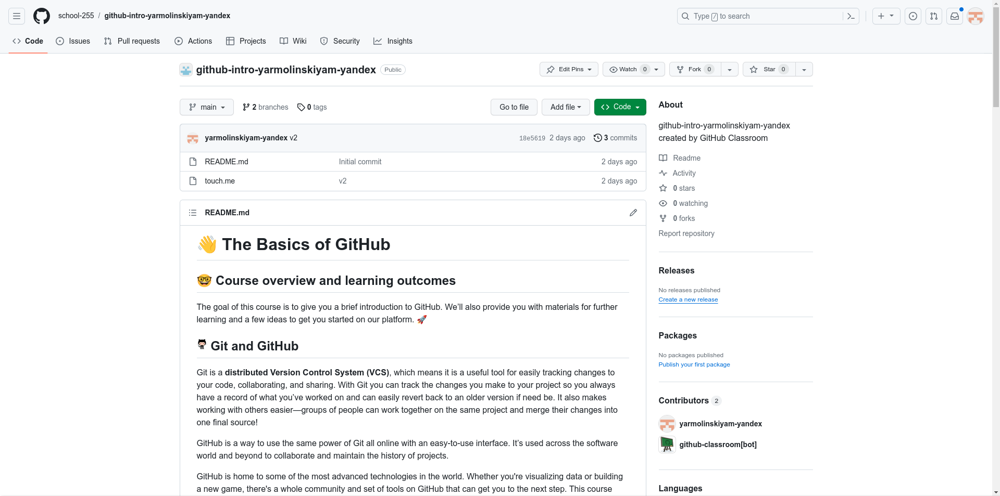
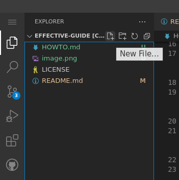
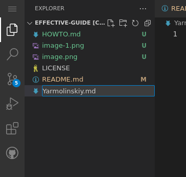
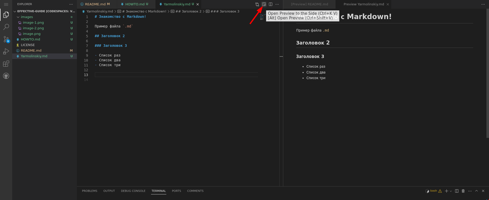
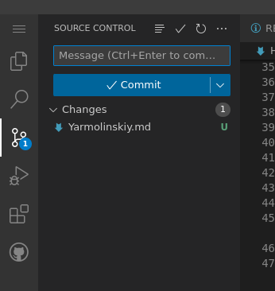

# Инструкция по выполнению заданий

## Что делать после получения задания?

После того, как ты подтвердишь получение задания и, немного подождав, одновишь страницу тебя перекинет в новый репозиторий с заданием в нем и ты увидишь примерно следующую картину:

Как было сказано ранее, репозиторий по свой сути - просто папка в которой хранятся файлы и другие папки. Здесь можно кликать на названия файлов и смотреть их содержание. Так ты можешь ознакомится с обоими текстовыми файлами `README.md` и `HOWTO.md`. Однако наша задача - создать новый файл и запушить его в удаленный репозиторий. Для этого мы будем использовать инструмент под названием GitHub Codespaces.

## Что такое GitHub Codespaces?

GitHub Codespaces - это облачная среда разработки, предоставляемая GitHub. Она позволяет разработчикам работать в специализированной, настраиваемой среде разработки, которая выполняет необходимые задачи в нужном месте.

Основные преимущества использования GitHub Codespaces включают:

- Использование предварительно настроенной среды разработки, которая содержит все необходимые инструменты, языки и конфигурации для работы над проектом.

- Доступ к ресурсам, которые вам могут не хватать на вашем локальном компьютере, позволяя работать в облачной среде с достаточной производительностью и пространством для хранения.

- Возможность работать из любого места, используя только веб-браузер. Вы можете работать в Codespaces на своем собственном компьютере, на ноутбуке друга или на планшете.

- Возможность выбора редактора для работы: в браузере в веб-клиенте VS Code или выбор из выбора настольных приложений.

- Возможность работы над несколькими проектами, используя несколько Codespaces для работы над отдельными проектами или над различными ветвями одного и того же репозитория.

Вы можете подключаться к своим Codespaces из браузера, из Visual Studio Code, из приложения JetBrains Gateway или с помощью GitHub CLI.

Переводя с нейросетевого на русский: Codespaces - виртуальная машина на Linux с запущеным Visual Studio Code и предустановленными инструментами для разработки (Python, C++, Docker, JS, ...)

## Как этим пользоваться?

Благодаря Codespaces мы можем работать над файлами в репозитории прямо из браузера.

### Как же создать файл в VSCode?

Для создания нового файла необходимо нажать кнопку "New File...":

И ввести его название:

Дважды кликнув на файл он откроется в окне редактора и его можно будет редактировать.

При работе над файлом может возникнуть потребность посмотреть на отрендеренный файл. Для этого можно использовать кнопку "Open Preview to the Side":

В этом окне весь текст будет отформатирован и картинки будут отображаться.

